# 📱 Phone Store Management System (Java Swing)

This is a desktop application for managing a phone store. 

## 🛠️ Technologies Used

- **Language:** Java  
- **GUI:** Java Swing  
- **Database:** MySQL (via XAMPP)  
- **Architecture:** MVC (Model-View-Controller)

## 🚀 Getting Started

### 1. Clone the repository:
```bash
git clone https://github.com/Vunas/QLDT.git
```

### 2. Open the project in your IDE (IntelliJ, NetBeans, Eclipse, etc.)

### 3. Set up the database:
- Make sure **XAMPP** is installed and running (Apache & MySQL).
- Open **phpMyAdmin** and import the provided `qldt.sql` file.
- Ensure the database is named: `qldt`

### 4. Run the application:

## 📂 Project Structure

```
📁 DOANJAVA/
┣ 📁 database/ # SQL files or database configs
┣ 📁 lib/ # External libraries (.jar)
┣ 📁 src/ # Source code
┃ ┣ 📁 BLL/ # Business Logic Layer
┃ ┣ 📁 DAO/ # Data Access Objects
┃ ┣ 📁 DTO/ # Data Transfer Objects (Model classes)
┃ ┗ 📁 GUI/ # User Interface
┃ ┣ 📁 DiaLog/ # Dialog components (pop-ups)
┃ ┣ 📁 Frame/ # Main application frames/windows
┃ ┣ 📁 Panel/ # Swing panels (forms per module)
┃ ┗ 📁 pages/ # Possibly container pages or scenes
┣ 📁 resources/ # Icons, images, and static files
┣ 📁 util/ # Utility/helper classes
┣ ...
```

## 💡 Features

The system includes the following modules:

0. **🔐 Đăng nhập (Login)**  
   

1. **🏠 Home (Trang chủ)**  
   Overview dashboard with key information, quick access to main features, and system stats.  
   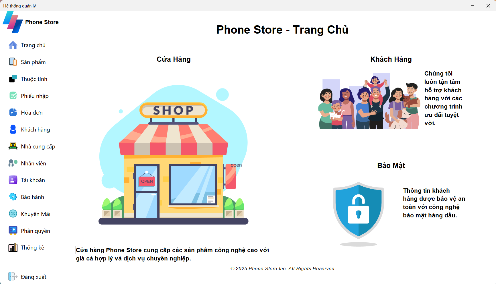

2. **📦 Products (Sản phẩm)**  
   Manage phone products: add, update, delete, search, and categorize.  
   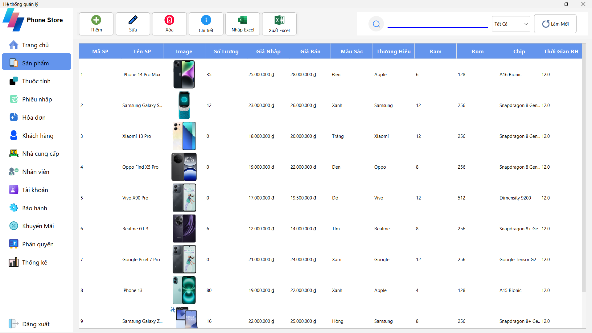

3. **⚙️ Attributes (Thuộc tính)**  
   Manage attributes like brand, color, capacity, screen size, etc., linked to products.  
   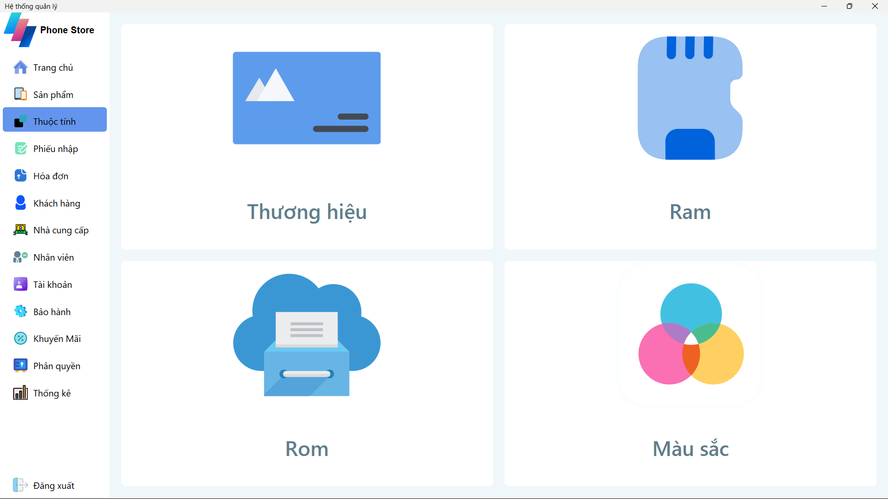

4. **📥 Import Receipts (Phiếu nhập)**  
   Handle inventory imports from suppliers, including quantity and pricing.  
   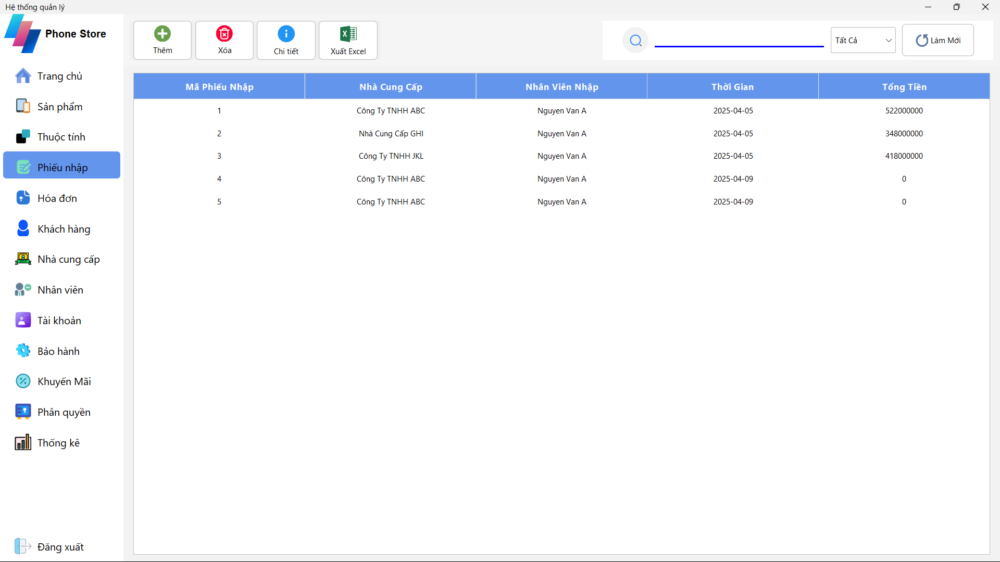

5. **🧾 Invoices (Hóa đơn)**  
   Sales invoice management with detailed customer and product information.  
   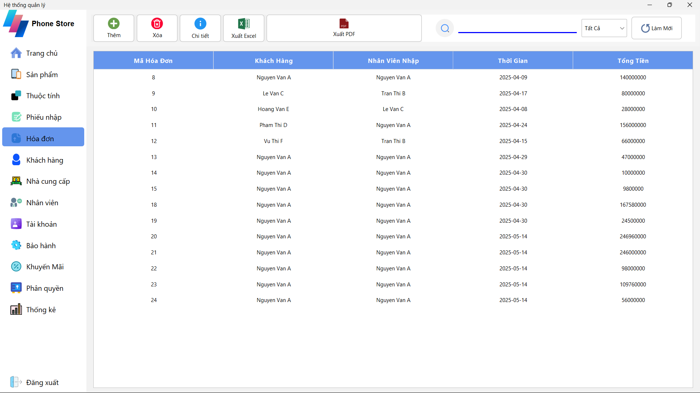


6. **👤 Customers (Khách hàng)**  
   Manage customer data and purchase history.  
   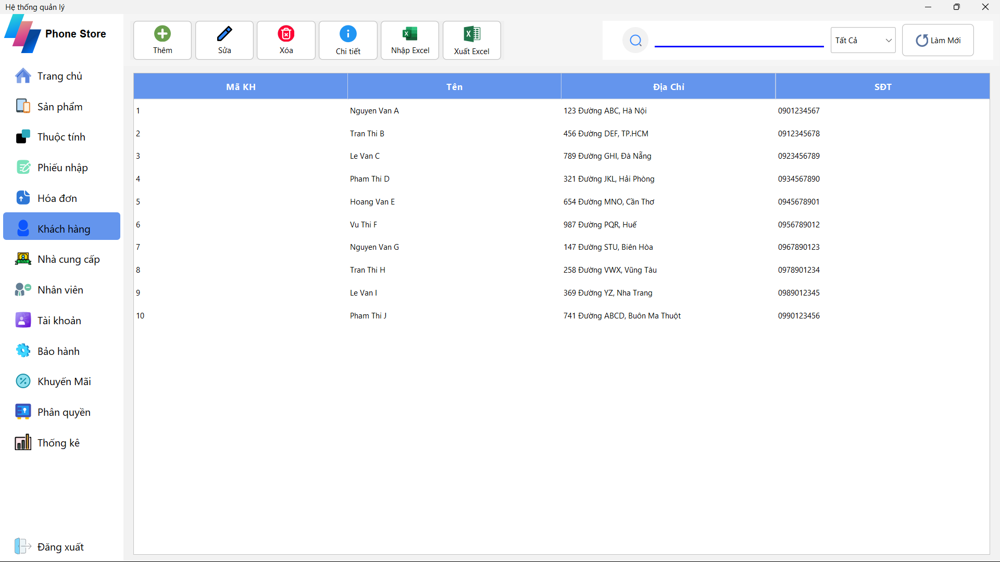

7. **🏭 Suppliers (Nhà cung cấp)**  
   Store and manage supplier details and purchase transactions.  
   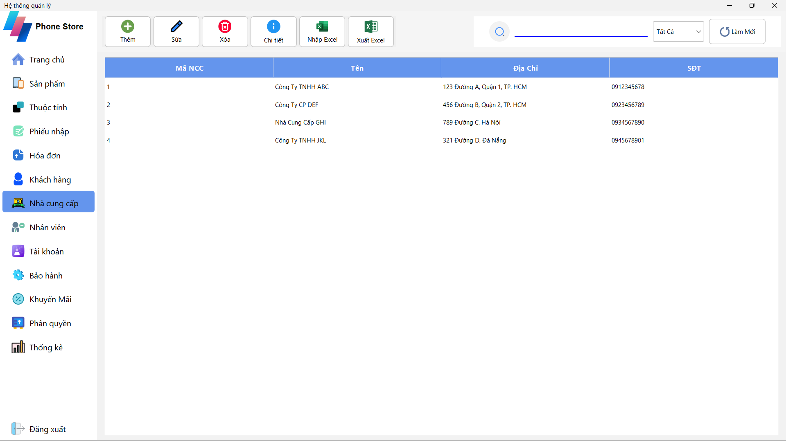

8. **👨‍💼 Employees (Nhân viên)**  
   Employee information management and roles assignment.  
   

9. **🔐 Accounts (Tài khoản)**  
   Account creation, login system, and secure access control.  
   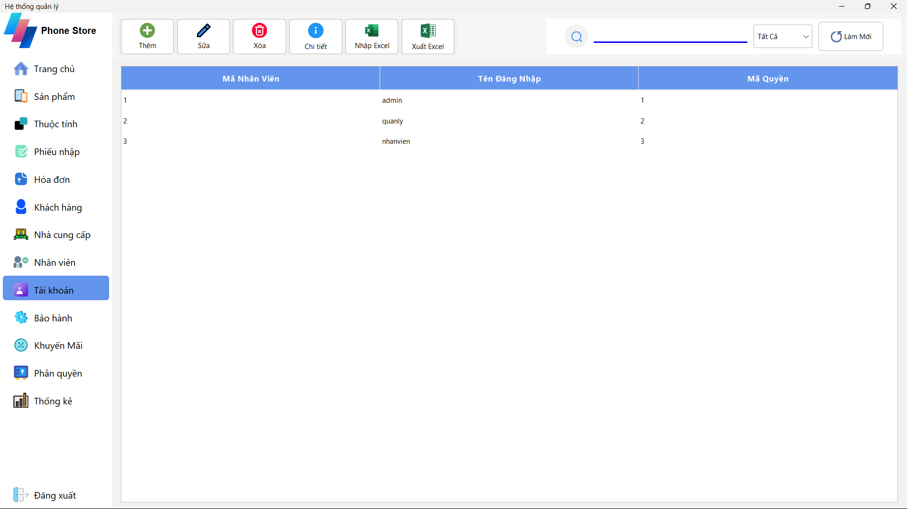

10. **🛠️ Warranty (Bảo hành)**  
    Manage product warranty records and processing.  
    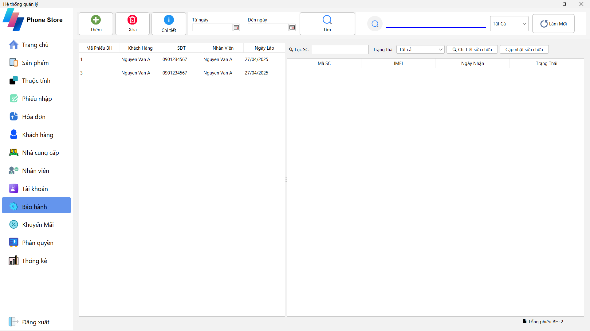
    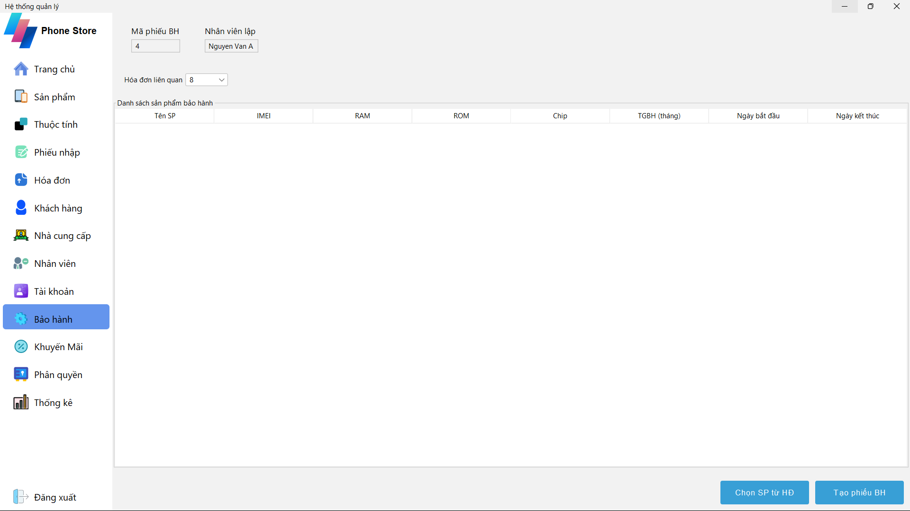
    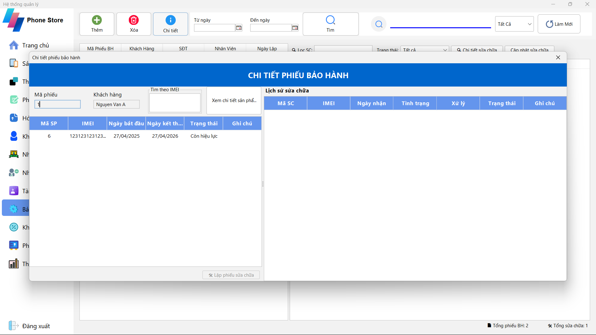
    
12. **🔑 Permissions (Phân quyền)**  
    Role-based access control system for different user levels (admin, staff, etc.).  
    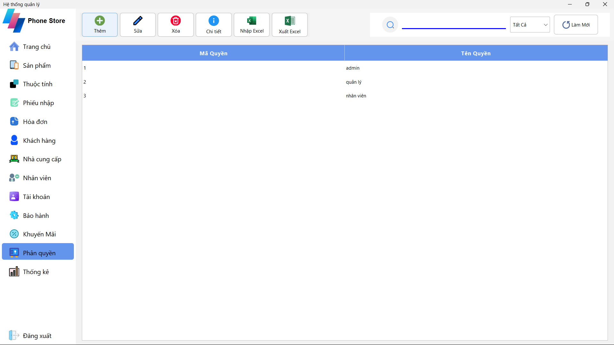
    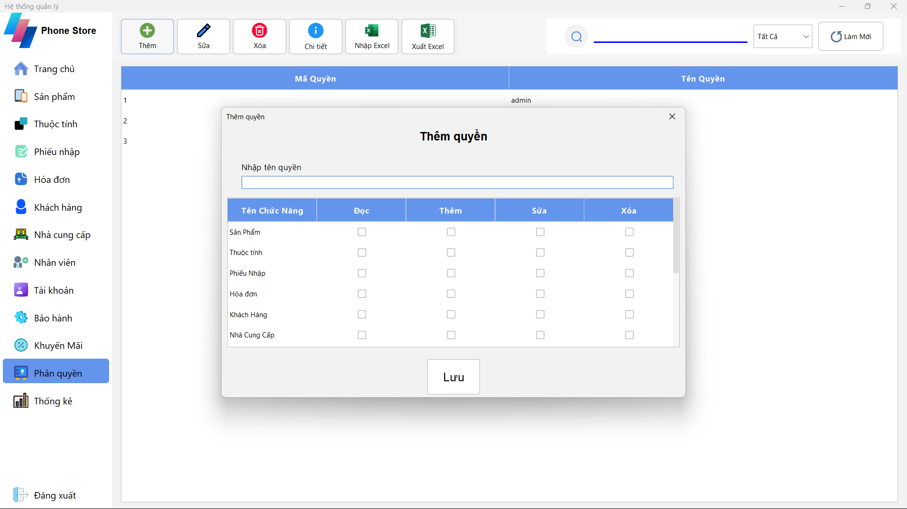

13. **📊 Statistics (Thống kê)**  
    Generate reports and visualize sales, inventory, and user data using charts.  
     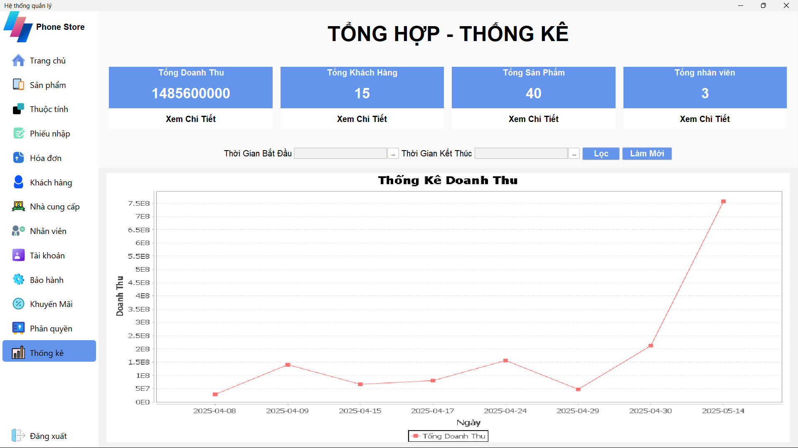
     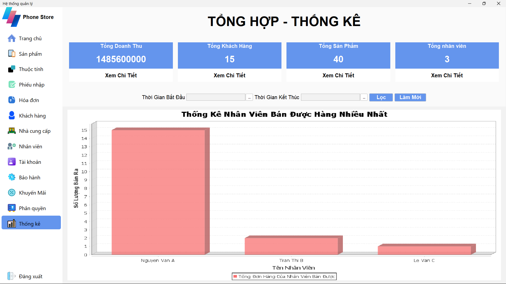
     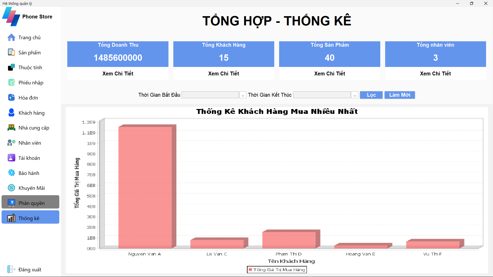

## 👨‍💻 Author

- GitHub: [@Vunas](https://github.com/Vunas)

## 📄 License

This project is licensed under the MIT License - see the [LICENSE](LICENSE) file for details.
